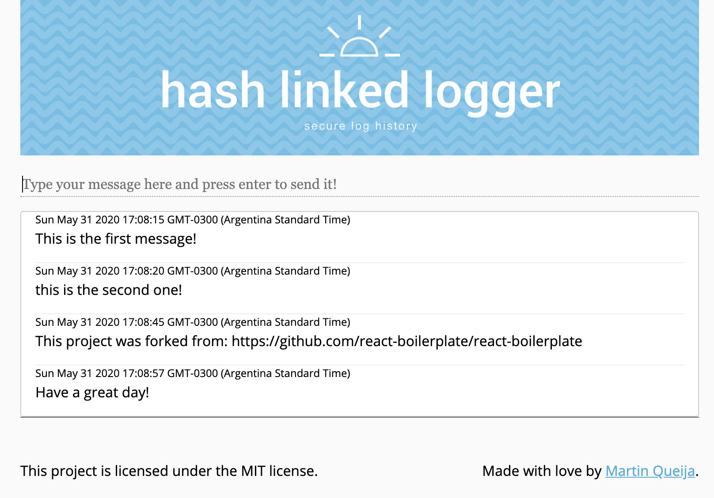

# Hash Linked Logger

This is a node-typescript API for securing logs in a csv file. Each log has a hash which is calculated from the previous log hash, the log message and a nonce. Requests attempting to write an entry must generate a proof of work by finding the nonce that returns a hash with NONCE_AMOUNT_ZEROS (currently set at 2) at the beginning.

As so we can guarantee the integrity of the databse by re-calculating all the hashes.

Parallel requestes "compete" to find the nonce faster and secure themselves the entry in the log.

The log is stored in the root folder with the name `hashLinkedLogs.csv`

An example log file:
```
00d2dc59a7bfcf15b4c7cc4977632c456d6926bec40bb817a31d2596725ad458,This is the first message!,2020-05-31T20:08:15.850Z,0
0066fcf76d881cf45be79e619b49a6ce0bcb64a14d3729ea3f0c74f03abed9be,this is the second one!,2020-05-31T20:08:20.644Z,189
0067bc721a598c3a1bb3f3d53e4d8ac968118b4237085c2e1bc620d22d45eb5f,This project was forked from: https://github.com/react-boilerplate/react-boilerplate,2020-05-31T20:08:45.190Z,21
00910fd62562622ce7234ce4010056649eab2a829ae9b0fc0aa23e72db683f08,Have a great day!,2020-05-31T20:08:57.512Z,223
```

Find the project front end repository [here](https://github.com/martinqueija/hash-linked-logger-react)




## Getting Started
### Installing

Get the latest version of node from the [official website](https://nodejs.org/) or using [nvm](https://github.com/creationix/nvm).  
Nvm approach is preferred.

Install dependencies by running `npm i`.

To start the app by default (development) run:  `npm start`

### Testing

Testing is done with jest with help of awilix for dependency injection.

To run the tests run `npm test`

## About

This project was written and is maintained by [Martin Queija](https://github.com/martinqueija).

## License

This project is licensed under the MIT License.

&nbsp;
